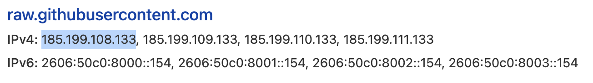
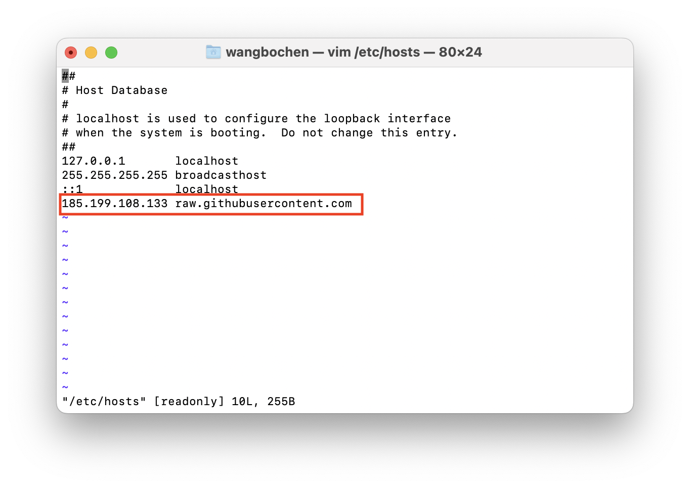
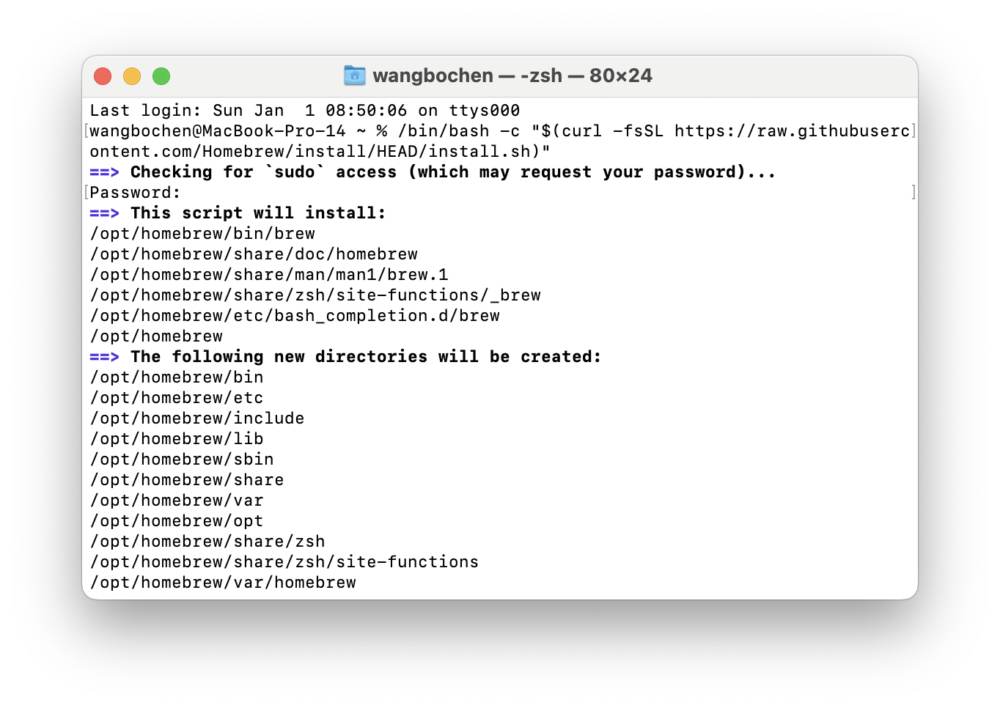
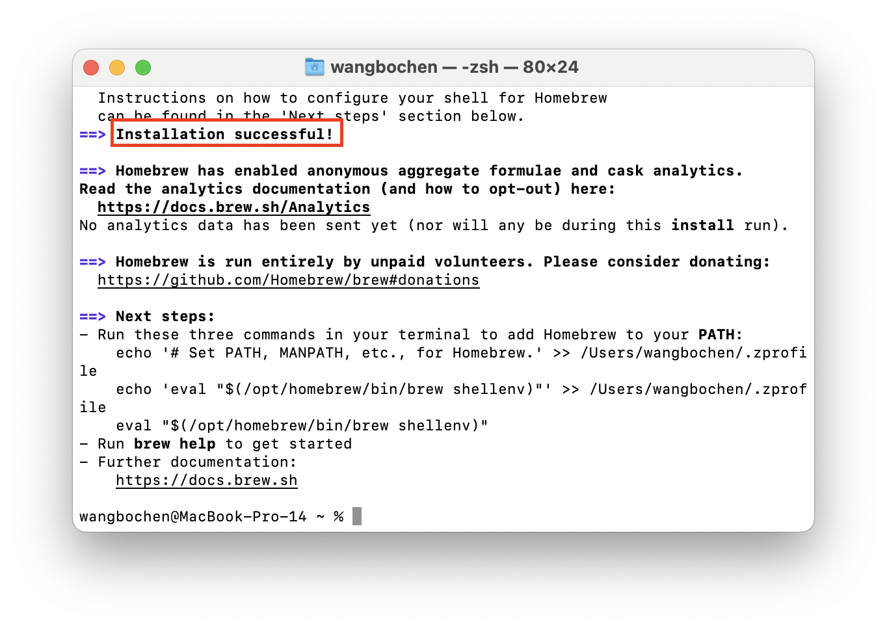
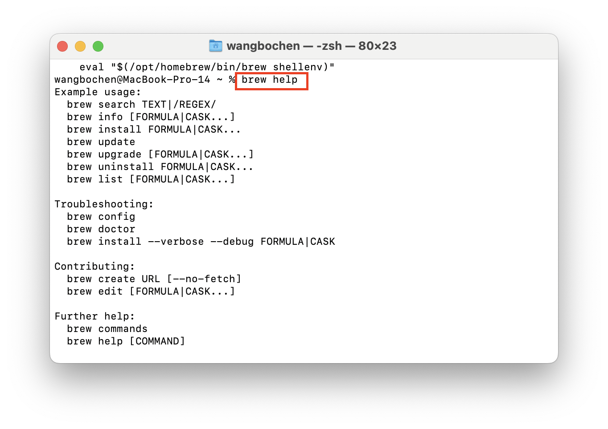
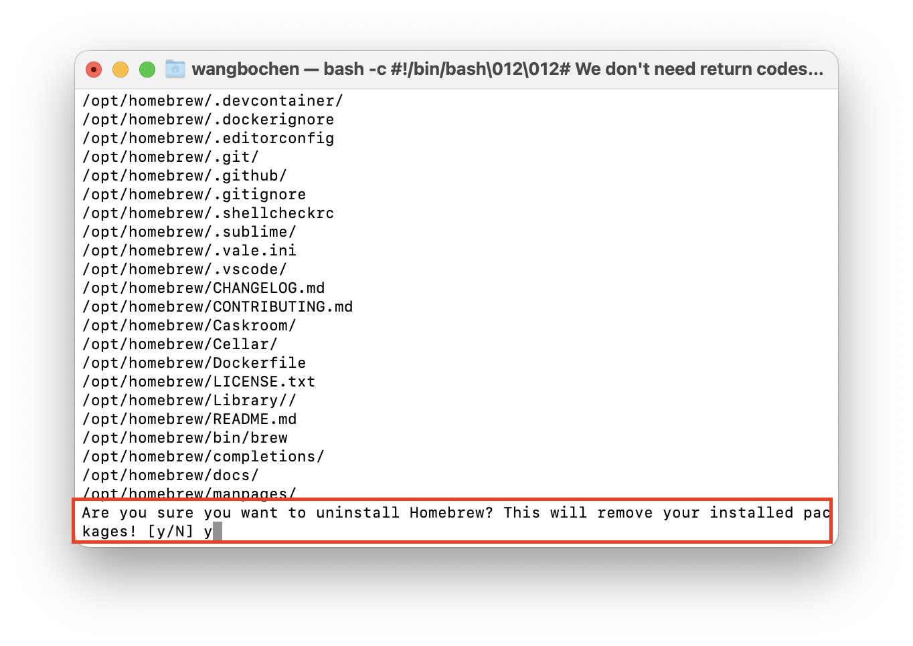
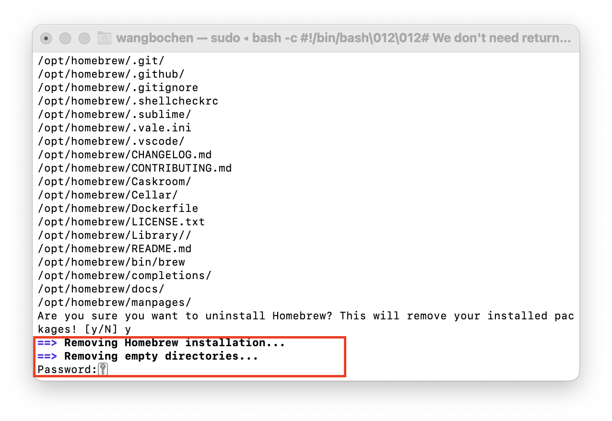

# 快速安装(卸载)homebrew(on Linux or macOS)

## 安装 Homebrew

```sh
/bin/bash -c "$(curl -fsSL https://raw.githubusercontent.com/Homebrew/install/HEAD/install.sh)"
```

```sh
Failed to connect to raw.githubusercontent.com port 443: Connection refused
```

- 出现上述错误，是因为[raw.githubusercontent.com](http://raw.githubusercontent.com)无法链接，需要配置 hosts

### 解决方式一

- （1）打开网站: <https://www.ipaddress.com/>
- 查询一下 raw.githubusercontent.com 对应的 IP 地址


我这里查询的是 185.199.108.133

- （2）替换系统的 host 文件
  注意:最好复制一份出来在更改
  

### 解决方式二

- 执行 install.sh 文件，_文件已经在仓库里，按需下载并执行_

执行命令

安装成功


### 运行 3 行命令 添加 Homebrew 环境变量

```sh
echo '# Set PATH, MANPATH, etc., for Homebrew.' >> /Users/wangbochen/.zprofile
echo 'eval "$(/opt/homebrew/bin/brew shellenv)"' >> /Users/wangbochen/.zprofile
eval "$(/opt/homebrew/bin/brew shellenv)"
```

- 运行 brew help



## 卸载 Homebrew

```sh
/bin/bash -c "$(curl -fsSL https://raw.githubusercontent.com/Homebrew/install/HEAD/uninstall.sh)"
```



输入管理员密码



卸载成功

