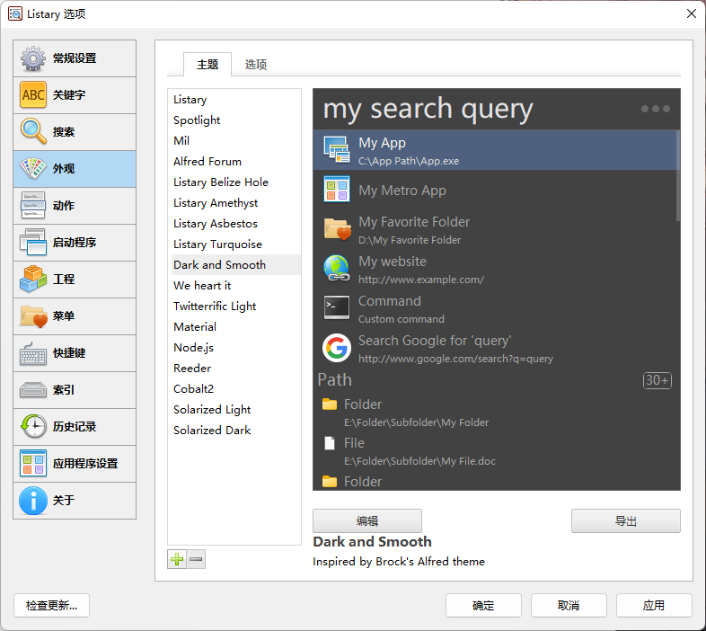
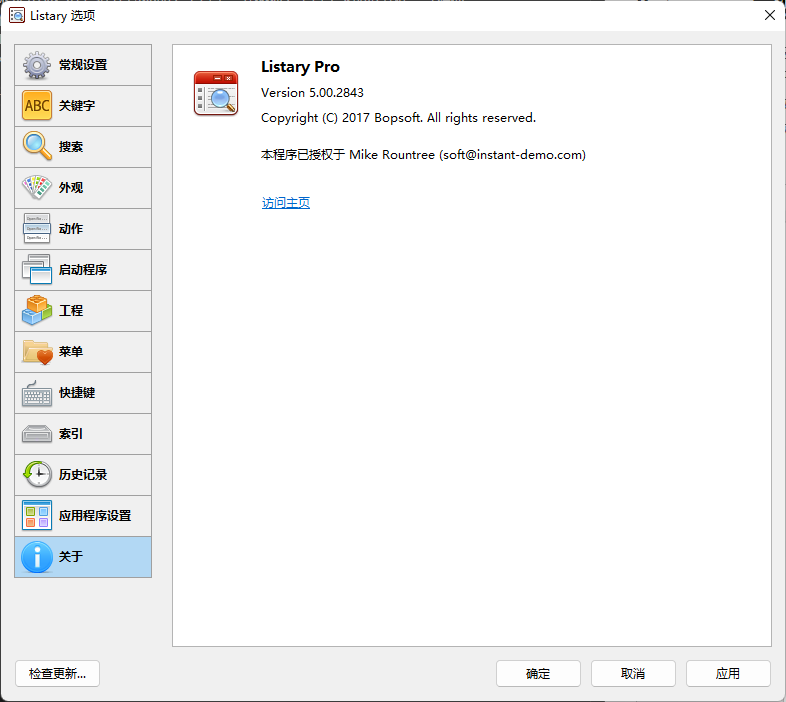

# 安装即时搜索 listary-pro

## listary pro 安装教程

[listary pro 下载](https://github.com/1655525068/listary-pro/archive/refs/tags/v1.0.0.zip)

- 1. 双击 listary 安装 listary。
- 2. 复制 MSVCP140.dll 到 listary 的安装目录，并替换安装目录下的该文件。（确保 listary 软件未运行，如果在运行，则需要先退出，再复制。）
- 3. 打开 listary 软件，找到升级到 listary pro 选项。
- 4. 打开 key.txt，分别复制 name，email，key 到 3 中对应的位置。点击验证即可。

## 选项界面

## 破解成功

