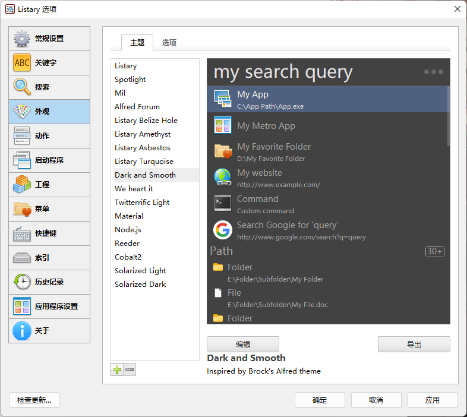
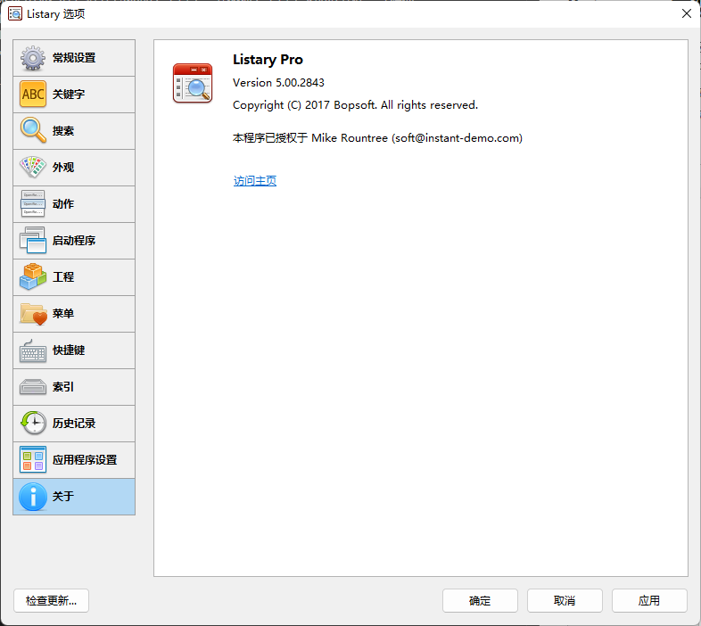

# 安装即时搜索listary-pro

### listary pro安装教程
[listary pro下载](https://github.com/1655525068/listary-pro/archive/refs/tags/v1.0.0.zip)
- 1. 双击listary安装listary。
- 2. 复制MSVCP140.dll到listary的安装目录，并替换安装目录下的该文件。（确保listary软件未运行，如果在运行，则需要先退出，再复制。）
- 3. 打开listary软件，找到升级到listary pro选项。
- 4. 打开key.txt，分别复制name，email，key到3中对应的位置。点击验证即可。
## 选项界面

## 破解成功
